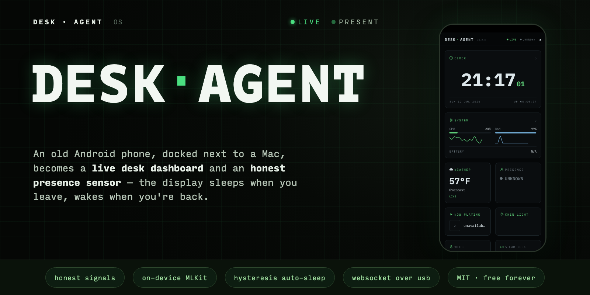
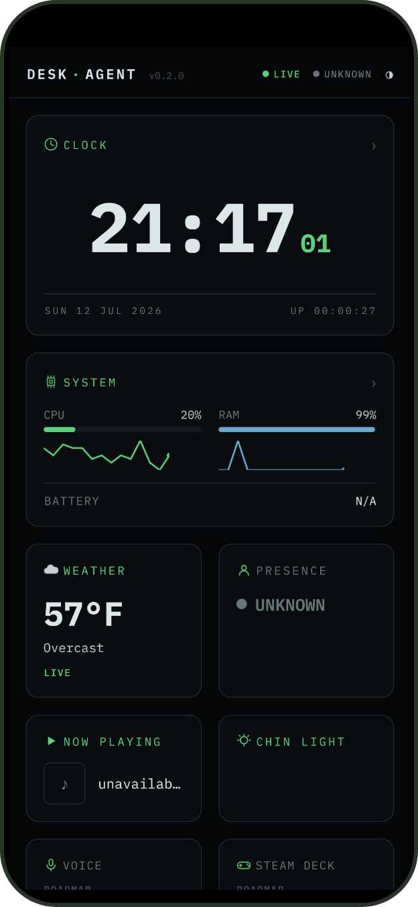
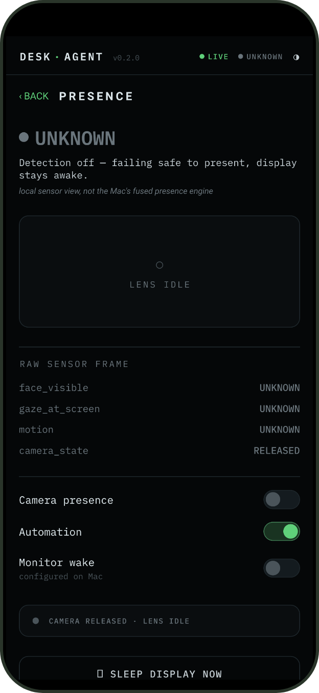
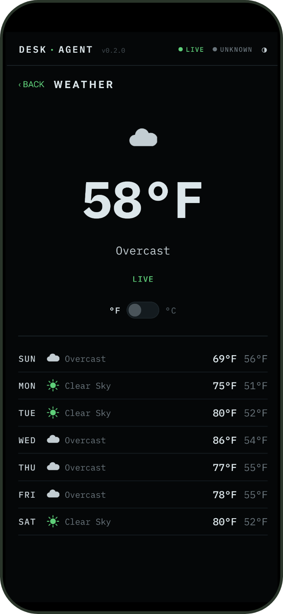
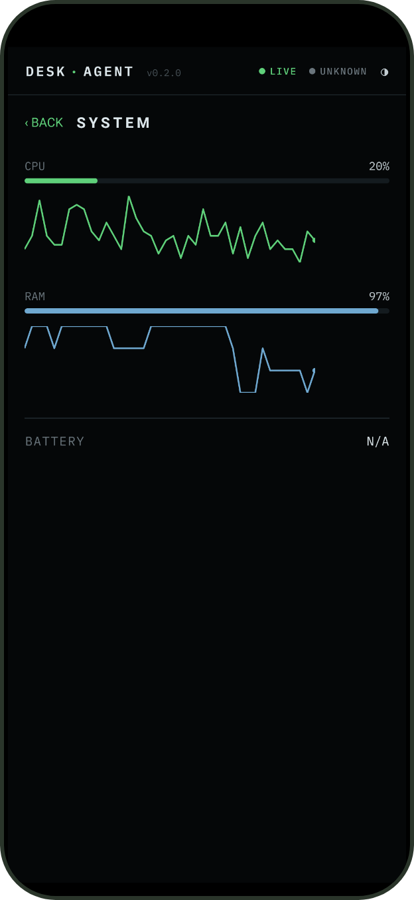
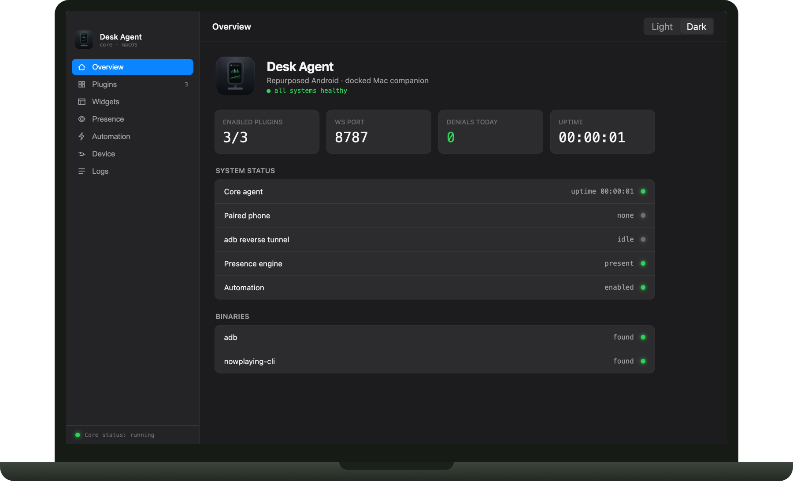
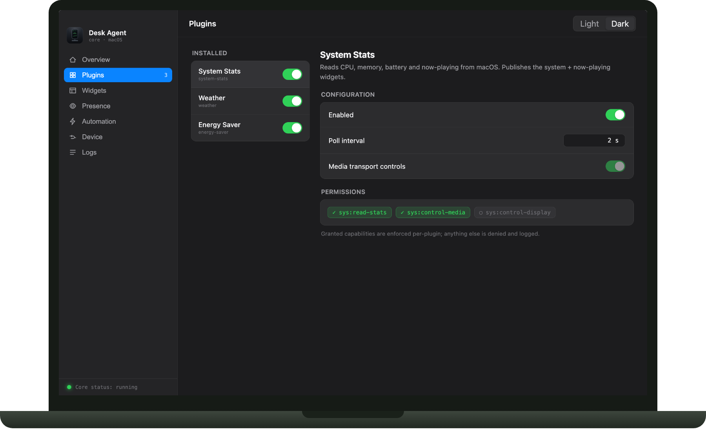

# Desk Agent OS

**v0.3.0** · 516 vitest + 57 Jest component + 9 JUnit/Robolectric tests passing · [Changelog](CHANGELOG.md)

<p align="center">
  
</p>

An old Android phone, docked next to a Mac, becomes a live desk dashboard and
an honest presence sensor. A Mac-side Node "brain" drives what the phone shows
and reacts to what the phone honestly reports seeing — starting with
auto-sleeping the display when you're genuinely away from your desk.

```
[Mac core: gateway, event bus, plugins, automation]  <--WebSocket over USB-->  [phone: RN dashboard + camera CV]
        |                                                                              |
   widget.update  ------------------------------------------------------------->  live widgets render
   sensor.face_visible / sensor.gaze_at_screen / sensor.motion / sensor.camera_state
        |  <-------------------------------------------------------------------  on-device MLKit face detection
   PresenceEngine (hysteresis fusion, Mac-side)
        |
   person_present  -->  AutomationEngine  -->  energy-saver plugin  -->  pmset displaysleepnow
```

**Honest signals, not vibes.** The phone never claims "person present" — it
only reports what its camera actually saw this frame (`face_visible`,
`gaze_at_screen`, `motion`) as debounced edge events, and never leaves the
device. All the judgment — fusing those signals, applying a multi-minute
hysteresis window so a still moment reading doesn't sleep your display, and
failing safe toward "present" the instant the camera or link looks unhealthy
— lives in a fully unit-tested state machine on the Mac
(`packages/core/src/presenceEngine.ts`).

The Mac side runs either as a plain Node process or inside the native
**menu-bar app** (`apps/mac`, Electron): a tray icon that tracks core health,
a settings window for config/plugins/widgets/automation, launch-at-login,
and auto-start when the phone is docked — no terminal required.

## Screenshots

**Phone app**

<table>
  <tr>
    <td align="center"><br/><sub>Dashboard</sub></td>
    <td align="center"><br/><sub>Presence (honest signals)</sub></td>
    <td align="center"><br/><sub>Weather</sub></td>
    <td align="center"><br/><sub>System stats</sub></td>
  </tr>
</table>

**Mac menu-bar app (settings window)**

<table>
  <tr>
    <td align="center"><br/><sub>Overview</sub></td>
    <td align="center"><br/><sub>Plugins</sub></td>
  </tr>
</table>

## Roadmap

| Slice | Status | Delivers |
|---|---|---|
| **1a** | ✅ shipped | Live dashboard (System Stats, Weather) + stubbed presence toggle proving the phone↔Mac spine |
| **1b** | ✅ shipped | Real camera presence detection, hysteresis-guarded auto-sleep, honest `sensor.*` protocol |
| **1c** | ✅ shipped | Programmatic wake of the external HDMI monitor when presence returns (no physical keypress), `caffeinate -u -t 2`. Hardware-verified on a OnePlus 6T + target Mac/monitor. `presence.wakeEnabled: false` disables it independently of auto-sleep. |
| **1d** | ✅ shipped | Designed multi-screen phone dashboard, live camera preview + face-box overlay on the Presence screen, Open-Meteo weather rework, and the Chin Light fullscreen fill-light widget |
| — | 🚧 on `main`, unreleased | macOS menu-bar app (Electron) that runs and supervises the core, widget-visibility sync from the Mac, auto-launch of the phone app on USB dock, phone screensaver on/off + duration controls, and a display visual-polish pass |

See [CHANGELOG.md](CHANGELOG.md) for what shipped in each slice.

## Quickstart

```bash
pnpm install
pnpm build
pnpm test
```

That builds and tests the whole monorepo. For running the actual agent + app
on real hardware (Node core on the Mac, React Native app on a docked Android
phone) and the full manual verification checklist, see **[SETUP.md](SETUP.md)**.

## Install (prebuilt)

Grab both apps from the
[latest release](https://github.com/prakharsingh/desk-agent/releases/latest).

**Mac (menu-bar app)** — download `DeskAgent-<version>-mac-arm64.dmg`, drag
to Applications. It's ad-hoc signed (free & open source — no Apple Developer
membership), so on first launch **right-click the app → Open** to get past
Gatekeeper, once. Or use Homebrew:

    brew tap prakharsingh/tap
    brew install --cask desk-agent

The app checks GitHub daily and shows an "Update available" item in the tray
menu — there is no auto-update (macOS forbids it for unsigned apps).

**Android (phone app)** — download `desk-agent-<version>.apk` onto the phone
and open it (allow "install unknown apps" when prompted). The phone must have
**USB debugging enabled** — the Mac drives it over `adb`; that's the
architecture, not an install shortcut (see [SETUP.md](SETUP.md)). For
update notifications, add the repo to
[Obtainium](https://github.com/ImranR98/Obtainium).

### Why no App Store / Play Store / F-Droid?

- **Mac App Store**: the sandbox forbids what the app *is* — spawning `adb`,
  `pmset`, `caffeinate`, and supervising the core process.
- **Google Play**: fees + testing-track rules, and since the phone needs USB
  debugging anyway, Play adds no reach. Revisited if a Wi-Fi transport ships.
- **F-Droid**: the presence sensor uses MLKit, a proprietary Google library.
- **Paid code signing**: this project is free forever — no $99/yr membership.

## Documentation

**Using it**

- **[SETUP.md](SETUP.md)** — from-zero install, running the core + app on
  real hardware, manual E2E checklist.
- **[Wiki](https://github.com/prakharsingh/desk-agent/wiki)** — deeper
  architecture notes, hardware specifics, and troubleshooting.

**Contributing**

- **[docs/ONBOARDING.md](docs/ONBOARDING.md)** — guided codebase tour for
  new contributors, including how to work without the reference hardware.
- **[CONTRIBUTING.md](CONTRIBUTING.md)** — branch/commit conventions, test
  expectations, PR process, versioning & release model.
- **[AGENTS.md](AGENTS.md)** — architecture map and load-bearing conventions
  for anyone (human or AI coding agent) working in this codebase.
- **How-to guides** — [writing a plugin](docs/guides/writing-a-plugin.md) ·
  [adding a widget](docs/guides/adding-a-widget.md).
- **Per-package READMEs** — [core](packages/core/README.md) ·
  [protocol](packages/protocol/README.md) ·
  [plugin-sdk](packages/plugin-sdk/README.md) ·
  [plugins](packages/plugins/README.md) ·
  [config-schema](packages/config-schema/README.md) ·
  [phone app](apps/android/README.md) · [macOS app](apps/mac/README.md).

**Project**

- **[CHANGELOG.md](CHANGELOG.md)** — what shipped in each release.
- **[SECURITY.md](SECURITY.md)** — trust model and how to report
  vulnerabilities.
- **[CODE_OF_CONDUCT.md](CODE_OF_CONDUCT.md)**

## License

[MIT](LICENSE)
